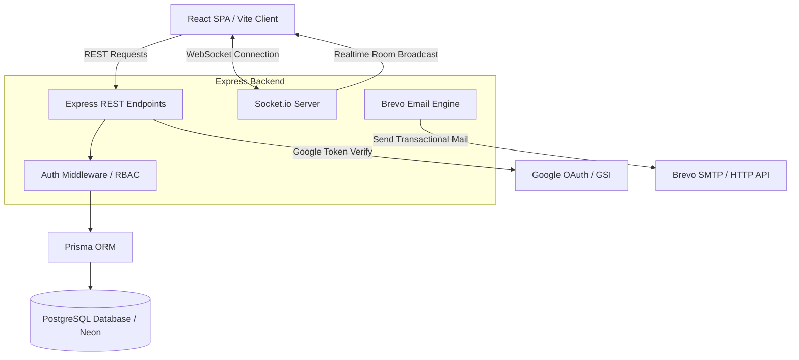

# Stride — Technical Architecture & System Design

Stride is a real-time, collaborative project management portal designed for high-performance team operations. This document details the engineering decisions, technical stack, system design patterns, and database schemas that power the platform.

---

## ── System Architecture Diagram ──



---

## 1. Technical Stack

### Frontend (Client)
*   **Core Framework**: **React (v19) / TypeScript** compiled with **Vite** for optimized development build loops and bundle trees.
*   **Server State & Caching**: **TanStack React Query (v5)**. Serves as the single source of truth for remote state, caching API responses, handling query invalidation, and coordinating background updates.
*   **Real-time Communication**: **Socket.io Client** for instant two-way event synchronization.
*   **Routing**: **React Router Dom (v7)** managing protected layout routes (Auth vs. Portal workspace dashboards).
*   **Rich Text Content**: **Tiptap Rich Text Editor** for task descriptions.
*   **Drag & Drop Engine**: **@dnd-kit/core** & **@dnd-kit/sortable** for smooth Kanban board card transitions and columns layout reorderings.
*   **UI Components & Icons**: Custom glassmorphic styling tokens, TailwindCSS, Lucide React icons, and Framer Motion for micro-animations.

### Backend (Server)
*   **Runtime Environment**: **Node.js / TypeScript** using **Express**.
*   **Database & ORM**: **PostgreSQL** (hosted on Neon database cloud), accessed through **Prisma ORM** for type-safe queries, migration control, and structural relationships.
*   **WebSockets**: **Socket.io Server** managing active user rooms (canvas, workspace, and individual user rooms) and real-time state broadcasts.
*   **Authentication & Access Control**: Custom token auth handler using **JWT** (JSON Web Tokens) with access/refresh token pairs, and middleware-based Role-Based Access Control (RBAC).
*   **Input Validation**: **Zod Schemas** validating all incoming request payloads at the router layer.
*   **Email Engine**: Custom **Brevo (Sendinblue) Transactional HTTP Client** utilising native `fetch` to bypass SMTP overhead.

---

## 2. Key Architecture Patterns & Design Decisions

### A. Real-Time State Invalidation over WebSockets
Rather than polling the server or triggering heavy page reloads, Stride combines WebSockets with TanStack Query for instant updates:
1. When an operation occurs (e.g. card moved, comment added, user joins workspace), the backend database commits the change and calls `fireEvent()`.
2. `fireEvent` logs an entry in the database `Event` stream (for audits) and broadcasts a payload to the relevant Room (`workspace:${workspaceId}` or `canvas:${canvasId}`) via Socket.io.
3. The client receives the broadcast in hooks like [useWorkspace.ts](file:///d:/Stride/client/src/hooks/useWorkspace.ts) and [useEvents.ts](file:///d:/Stride/client/src/hooks/useEvents.ts).
4. Instead of manually splicing local lists, the client tells React Query to invalidate specific keys (e.g., `['workspace-members']`). React Query automatically fetches the fresh, authoritative state from the server in the background, keeping the UI instantly updated.

### B. Stateless JWT Authentication with Cookies
Stride prevents JWT storage vulnerabilities (such as localStorage XSS theft) through a dual-token setup:
*   **Access Token**: Short-lived JWT (15 mins) returned in the API payload, held in memory by the client.
*   **Refresh Token**: Long-lived token (30 days) stored as an `httpOnly`, `Secure` (in production), and `SameSite: Lax` cookie.
*   **Silent Refresh**: On startup or access token expiry, the client calls `/auth/refresh`. The browser attaches the httpOnly refresh cookie, and the server returns a new access token seamlessly.

### C. Capability-Based Workspace Invitations
The invitation flow utilizes secure, one-time capability tokens:
1. **Invite Generation**: Admin generates an invite. The backend creates a record in the `Invite` model with a unique `uuidv4` token and a 7-day expiration.
2. **Acceptance Landing Page**: The recipient opens `/invite/:token`. The client calls `GET /auth/invite-verify/:token` (which requires no auth) to display workspace metadata.
3. **Onboarding Integration**:
    *   *Logged-in user*: Directly accepts, sending `{ token }` to `/auth/invite-accept`.
    *   *New user*: Prefills the email address, disabling modification so registration matches the invite email. Supports standard email/password credentials or Google Sign-In, linking the user to the workspace on success.

---

## 3. Database Schema

Managed via Prisma, the relational schema models workspaces, permissions, boards, cards, and activity streams:

```prisma
// Core User Profile
model User {
  id            String   @id @default(uuid())
  name          String
  email         String   @unique
  passwordHash  String?  @map("password_hash")
  avatarUrl     String?  @map("avatar_url")
  emailVerified Boolean  @default(false) @map("email_verified")
  createdAt     DateTime @default(now()) @map("created_at")
  updatedAt     DateTime @updatedAt @map("updated_at")

  memberships   WorkspaceMember[]
  sentInvites   Invite[]          @relation("InviteSender")
  events        Event[]
}

// Workspace Organization
model Workspace {
  id          String   @id @default(uuid())
  name        String
  slug        String   @unique
  description String?
  logoUrl     String?  @map("logo_url")
  createdAt   DateTime @default(now()) @map("created_at")
  updatedAt   DateTime @updatedAt @map("updated_at")

  members     WorkspaceMember[]
  canvases    Canvas[]
  invites     Invite[]
}

// Workspace Members (RBAC mapping)
model WorkspaceMember {
  id          String   @id @default(uuid())
  workspaceId String   @map("workspace_id")
  userId      String   @map("user_id")
  role        String   @default("member") // admin, manager, member
  joinedAt    DateTime @default(now()) @map("joined_at")

  workspace Workspace @relation(fields: [workspaceId], references: [id], onDelete: Cascade)
  user      User      @relation(fields: [userId], references: [id], onDelete: Cascade)

  @@unique([workspaceId, userId])
}

// Secure Invite Tokens
model Invite {
  id          String   @id @default(uuid())
  workspaceId String   @map("workspace_id")
  email       String
  role        String   @default("member")
  token       String   @unique
  senderId    String   @map("sender_id")
  accepted    Boolean  @default(false)
  expiresAt   DateTime @map("expires_at")
  createdAt   DateTime @default(now()) @map("created_at")

  workspace Workspace @relation(fields: [workspaceId], references: [id], onDelete: Cascade)
  sender    User      @relation("InviteSender", fields: [senderId], references: [id], onDelete: Cascade)
}

// Boards (Canvases) within workspaces
model Canvas {
  id          String   @id @default(uuid())
  workspaceId String   @map("workspace_id")
  name        String
  description String?
  icon        String?  @default("📋")
  visibility  String   @default("public") // public, private
  defaultView String   @default("board") @map("default_view")
  archived    Boolean  @default(false)
  createdAt   DateTime @default(now()) @map("created_at")
  updatedAt   DateTime @updatedAt @map("updated_at")

  workspace Workspace      @relation(fields: [workspaceId], references: [id], onDelete: Cascade)
  columns   CanvasColumn[]
  cards     Card[]
}
```

---

## 4. Key Performance Optimizations

1.  **Direct API Integrations**: Bypassed heavy dependencies like `nodemailer` by building a custom SMTP HTTP payload client to query Brevo directly, improving email dispatch times.
2.  **Optimistic UI Updates**: Using React Query's `setQueryData` to immediately render cards drag-and-drops before the server database update completes, ensuring zero visual lag.
3.  **Surrogate Keys & Indexes**: Composited unique constraints like `@@unique([workspaceId, userId])` ensure rapid lookup times in PostgreSQL while preventing duplication errors.
4.  **Database Connection Pooling**: Utilizing Neon's connection pooler to handle high-frequency concurrent server connections.
